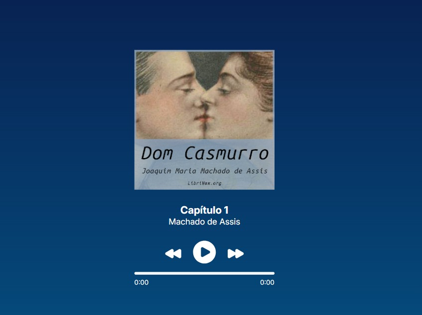
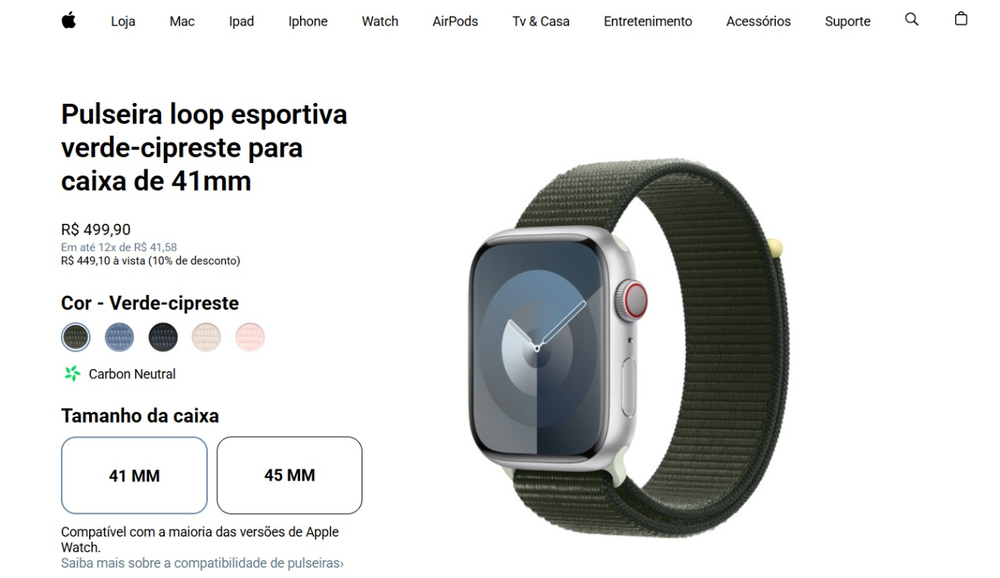

# Projetos e desafios

Este repositório reúne alguns projetos e desafios desenvolvidos com HTML, CSS e JavaScript. Todos foram desenvolvidos para praticar e aprender mais sobre desenvolvimento web.

## Índice 🔗

- [Projeto Audiobook](#projeto-audiobook)
- [Projeto Apple Watch](#projeto-apple-watch)
- [Blog Preview card](#blog-preview-card)
- [Social Links](#social-links)
- [QR Code](#qr-code)
- [Projeto Museu](#projeto-museu)
- [Recipe page](#recipe-page)

## Projeto Audiobook

É uma página web de um audiobook de Dom Casmurro. Ela permite que o usuário escute o livro, avance para o próximo capitulo ou retorne, pause e reproduza o áudio, além de contar com uma barra de progresso.  
[Clique aqui](https://leeticia-araaujo.github.io/desafios/projeto-audiobook/) para ir para a página.    

## Projeto Apple Watch

Trata-se de uma página web inspirada no design da página do Apple Watch. Permite ao usuário alterar a cor do relógio, o tamanho da caixa e as imagens de visualização.  
[Clique aqui](https://leeticia-araaujo.github.io/desafios/projeto-apple-watch/) para ir para a página.    

## Blog Preview card

Uma página de um cartão de visualização de um blog, desafio proposto pelo frontend mentor com o objetivo de se familiarizar com box model.  
[Clique aqui](https://leeticia-araaujo.github.io/desafios/desafio-card/) para ir para a página.    

## Social Links

Página similar a um linktree com minhas redes sociais.  
[Clique aqui](https://leeticia-araaujo.github.io/desafios/desafio-social-links/) para ir para a página.    

## QR Code

É uma página exibindo um qr code, o desafio foi proposto pelo frontend mentor.  
[Clique aqui](https://leeticia-araaujo.github.io/desafios/desafio-qr-code/) para ir para a página.    

## Projeto Museu

Página inicial de um site de museu, exibindo os museus mais visitados do país e outras sugestões.  
[Clique aqui](https://leeticia-araaujo.github.io/desafios/projeto-museu/) para ir para a página.    

## Recipe page

Receita de um cupcake de café com chantily, possui uma lista com os ingredientes e o modo de preparo.   
[Clique aqui](https://leeticia-araaujo.github.io/desafios/projeto-pag-receita/) para ir para a página.    

