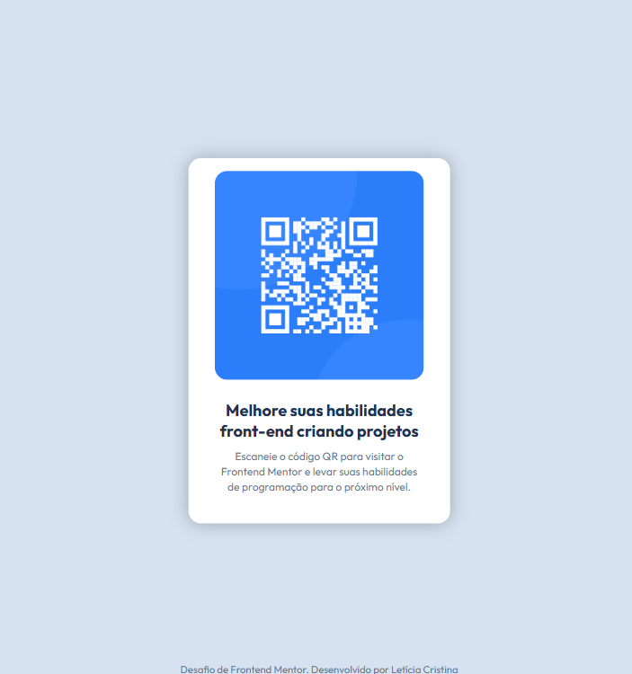

# Projetos e desafios

Neste repositório estão alguns projetos e desafios que fiz utilizando html, css e um pouquinho de javascipt

## Índice 🔗

- [Blog Preview card](#blog-preview-card)
- [Social Links](#social-links)
- [QR Code](#qr-code)
- [Projeto Museu](#projeto-museu)
- [Recipe page](#recip-page)

## Blog Preview card

Uma página de um cartão de visualização de um blog, desafio proposto pelo frontend mentor com o objetivo de se familiarizar com box model.  
[Clique aqui](https://leeticia-araaujo.github.io/desafios/desafio-card/) para visualizar.    

## Social Links

É uma página similar a um linktree com minhas redes sociais.  
[Clique aqui](https://leeticia-araaujo.github.io/desafios/desafio-social-links/) para visualizar.    

## QR Code

É uma página exibindo um qr code, o desafio foi proposto pelo frontend mentor.  
[Clique aqui](https://leeticia-araaujo.github.io/desafios/desafio-qr-code/) para visualizar.    

## Projeto Museu

Página inicial de um site de museu, exibindo os museus mais visitados do país e outras sugestões.  
[Clique aqui](https://leeticia-araaujo.github.io/desafios/projeto-museu/) para visualizar.    

## Recipe page

Receita de um cupcake de café com chantily, possui uma lista com os ingredientes e o modo de preparo.   
[Clique aqui](https://leeticia-araaujo.github.io/desafios/projeto-pag-receita/) para visualizar.    

